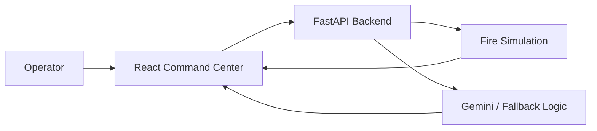

# FireShield AI

FireShield AI is a wildfire decision-support demo built for a hackathon. It simulates fire spread, scores risk, recommends incident actions, generates public alerts, and produces an incident report from a single command dashboard.

## Demo Flow

1. Set an ignition point on the map.
2. Adjust wind, humidity, and spread conditions.
3. Review the live simulation and risk score.
4. Use the incident commander panel to get evacuations, resource deployment, and road closure guidance.
5. Generate public alerts and an incident report for the final handoff.

## Stack

- Frontend: React, Vite, Leaflet, Framer Motion
- Backend: FastAPI, NumPy
- AI: Google Gemini via `google-genai`, with deterministic fallbacks when the key is missing

## Run Locally

Start the backend first:

```powershell
Set-Location .\fireshield-backend
python -m uvicorn main:app --reload --port 8000
```

Then start the frontend in a second terminal:

```powershell
Set-Location .\fireshield-frontend
npm install
npm run dev
```

Open the Vite URL shown in the terminal, usually `http://localhost:5173`.

## Optional AI Configuration

If you want live Gemini responses instead of the fallback copy, set:

```powershell
$env:GEMINI_API_KEY = "your-key-here"
```

You can also override the model with `GEMINI_MODEL`.

## Architecture



## Presentation Tip

For the hackathon demo, lead with the map, then show the incident commander recommendation and public alert generation. That sequence best demonstrates the end-to-end value of the product.
